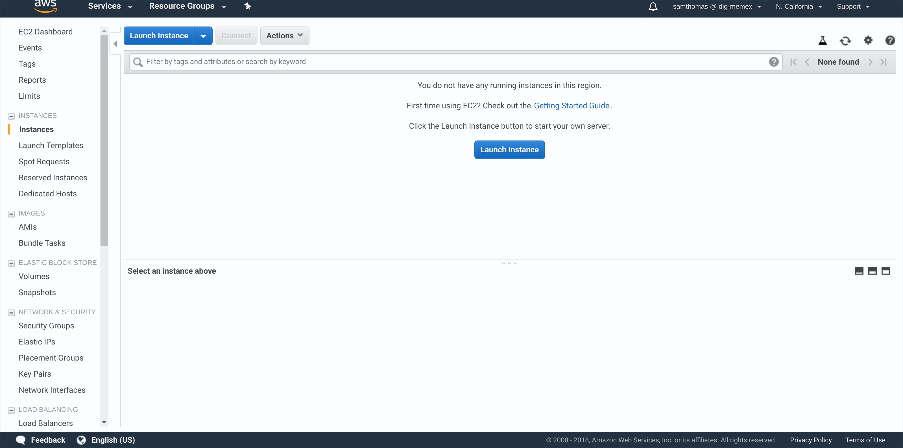
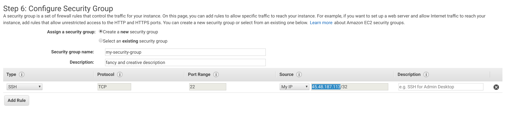
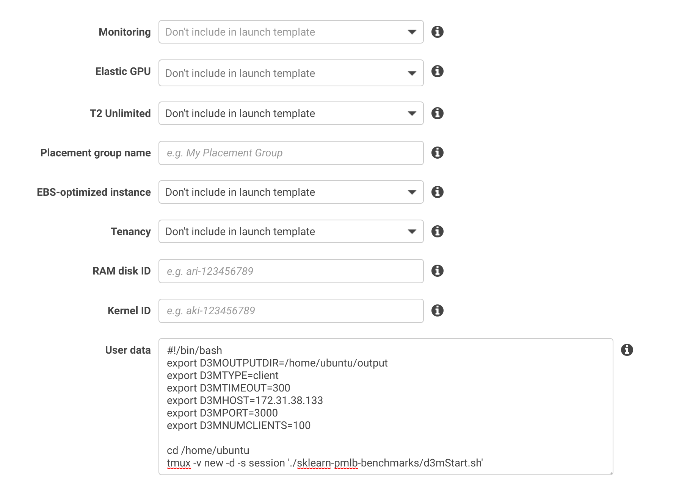
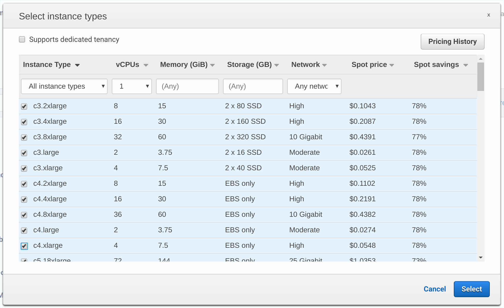
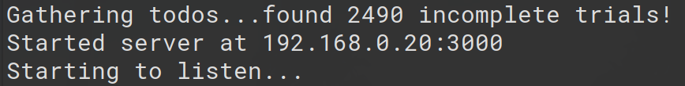

# Sklearn PMLB Benchmark

This repository holds the code used run benchmark of the Sklearn classifiers on the [PMLB Dataset](https://github.com/EpistasisLab/penn-ml-benchmarks).
Results for this datarun can be found here: [completed-w-holes-7-26-2018.pkl](https://drive.google.com/open?id=1FFY_hlvYbcmBvi2UzLk4N8CdDF9A4Ptq).
A lot of this code was derived from the code used to run the original PMLB experiments which is housed here:
[sklearn-benchmarks](https://github.com/rhiever/sklearn-benchmarks).

Here is a link to the original paper by Randal S. Olson, William La Cava, Patryk Orzechowski, Ryan J. Urbanowicz, and Jason H. Moore (2017).
[PMLB: a large benchmark suite for machine learning evaluation and comparison](https://biodatamining.biomedcentral.com/articles/10.1186/s13040-017-0154-4).

## Why?
The reason that we reran this experiment was so that we could gather data on generalization error.
Specificaly, in the original paper, they only recorded the average `accuracy`, `macrof1`, and `balanced accuracy` on the test data
after 10 fold cross validation.
We used the same metrics but recorded both test and train averages after 10 fold cross validiation.
On top of this, we also record fit and score times.
For a full list of every metric we save, look below.

 
# Program Architecture
This section outlines the architecture of the program.

## Overview
This program uses a client-server architecture with a variable number of clients and a single scheduler.
The clients and the scheduler communicate using a custom protocol over TCP.
All the data is passed in JSON. 
There were 2 main considerations that guided the development of this program:
 1) The datarun should be robust to the failures of clients.
 2) The datrun should be easily resumable.

With these in mind, I will present a high overview of the program.
There is a single centralized scheduler that keeps a queue of all trials.
When a client wants a trial, it asks the scheduler. The scheduler hands it a trial from the top of the queue.
When the client finishes executing the trial, it sends the scheduler the result.
The client is then free to ask for another trial.

The communication in this architecture is completely client driven. This removes the need for the scheduler to
have a list of the clients ahead of time and allows the clients ephermeral. You can start and stop clients without
having any effect on ths scheduler. This makes this program easily scalable to a large number of clients.

## Scheduler
The scheduler has 3 duties: to keep track of trials to be completed, to commit the result of a trial to a file, and to hand out trials to clients.
The scheduler first discovers all tasks by enumerating every method with all given hyperparameter settings (specified in the method files).
It then looks into the results directory and removes any tasks that have already been committed.
Once this is complete, the scheduler starts listening for clients.
As soon as a client connects to the scheduler, the scheduler starts a handler process that deals with all the communication with the client.
Putting the handler for each client in it's own process greatly increases the throughput of the scheduler.
Because all the communication is client driven, the scheduler simply has to respond to each type of message it receives.

Below is a list of all types of messages and how the scheduler responds to each.

### Message Types
 | Client's Request | Server's Response |
 |------------------|-------------------|
 | `verify`                              | `success`                                                        |
 | `trial request`                       | get item from the top of the todo queue and send `trial details` |
 | `trial done` (payload= trial results) | commit payload and confirm with `success`                        |
 | `trial cancel` (payload= id#)         | commit file for id# with reason for failure                      |
 | `terminate`                           | stop handler for this client                                     |

## Client
After the client connects to the scheduler. It simply runs a loop asking the scheduler for a trial, executing the trial, and then sending the results.
In order to allow the client to make use of multiple CPUs, there is parallelization on the client side. The client can start multiple processes.
Each process asks for a trial, executes the trial, commits the result, and then dies. The client is then free to start another process.

# Executing a Datarun
This section provides some guidelines for how to run this program on AWS.
I wrote a command line wrapper for `awscli`. This simplifies some common tasks. You can find that here: [aws-automation](https://github.com/sgpthomas/aws-automation).

## Overview
I will walk through creating an AMIs, security groups, configuring spot fleets, and automatically starting the program on instance launch.

### Creating an AMI
Once you get to the EC2 home screen, navigate to 'Instances' on the sidebar, and click 'Launch Instance'.



You then have to choose a base-OS for your AMI. I chose the Ubuntu 16.04 image because I'm very comfortable with Ubuntu.
Choose whatever are you comfortable with. This is will be a temporary machine so you can just choose the t2.micro instance type.
Then click 'Review and Launch'. Now we want to edit the security groups so click 'Edit security groups'. For now just make a
new security group and call it something you'll remember. Add a SSH connection wiht your IP address so that you can ssh into
this machine. Later we'll edit this security group to all communication between the clients and the server.



With this done, we are ready to launch. After clicking launch, you'll see a window asking about a KeyPair. If you don't know what this is
or haven't done it before, select 'Create a new key pair' from the dropdown and give it a name. Download the .pem file somewhere you'll remember.
(A good place is `~/.ssh`). You will need this file to connect to the machine. If you already have a key pair, you can use that one instead.
Launch the machine and then view your instances. You should see a new entry here. Note the IP address in the 'IPv4 Public IP' column.
Open up a terminal, and type `ssh -i ~/.ssh/tiger.pem ubuntu@54.67.123.98`. (Replacing `~/.ssh/tiger.pem` with your key and the IP address with the one you just noted.
Keep the `ubuntu@` part). Type `yes` at the prompt and your in. (If this doesn't work immediately the machine might not have finished launching).

Now you want to clone your code repository and install the necessary dependencies. I'll provide the commands I used for this project. Change them to whatever you need.

Install some programs.
```bash
sudo apt update && sudo apt upgrade
sudo apt install python3-pip tmux htop
```

Install project dependencies. Make sure the dependencies can be accessed from root because the clients will have to run as root.
```bash
cd sklearn-pmlb-benchmarks
sudo -H pip3 install -r requirements
```

Once you are done with all of your dependency installing, you are ready to make the AMI.
Go back to the console, select the machine, click 'Actions > Image > Create Image'.
Give it a name and then click 'Create Image'. It'll take a few minutes to create the image, but after that you're done.
You can terminate the instance. If you need to update this image for some reason, you can repeat the process but instead of choosing the Ubuntu base image, choose your custom image.

### Editing our Security Group
We want to edit the security group we made earlier to allow TCP traffic between are instances. To do this find 'Security Groups' in the sidebar.
Then find the security group you made in the list. Take note of the Group ID. Select it, then click 'Actions > Edit inbound rules'. 
Add a rule that allows all TCP through on any port with a source of the Group ID you just noted. It should look something like:


You might also need to add more SSH rules if you access your machines from multiple wifi networks. You can use this same process.

### Launch Template for the Spot Fleet
We now want to create a launch template for a spot fleet. Here we will specify the AMI to use, the security group to use, and a startup script.
There is a nice versioning system that makes it easier to update launch templates in the future. This is nice for changing the startup script and the AMI
as you debug problems. Before you make the launch template, be sure to note the AMI id and the Security Group id.
Find 'Launch Templates' in the side bar and click 'Create launch template'. We want to create a new template so choose that option. In the future,
choose 'Create a template version' for updating your launch template. Give it a name and description. We'll leave the 'Source template' as None.
Enter the AMI id next. We don't need to specify the Instance Type here. We'll do that in the actual Spot Fleet Request. Enter the name of your KeyPair and
keep the network type as 'VPC'. Next, scroll down to the Security Groups session, click 'Add new security groups' and then enter the security group id.
Open 'Advanced Details' and find the very last box titled 'User data'. We we can put a startup script. Copy the text from file `aws-spot-start.sh` into this box.
Later we'll need to update the D3MHOST variable to hold the IP of our scheduler. For now, it doesn't matter what this value is.



This is all we need for now, click 'Create launch template'.

### Spot Instances Configuration
Now we want to get a Spot Instance configuration file to use with the `aws-automation` script. If you want, you can go through the GUI
every time you want to request a fleet. I found it more convienent to download the JSON configuration file and then launch the fleet from the CLI.
If you want to use the CLI, do this step now. Otherwise, do this step after launching the scheduler. 

Go to 'Spot Requests > Request Spot Instances'. Choose the Request type and Amount based on what you want. I went with 'Request and Maintain' and a total target capacity of 100 vCPUs.
These settings are easy to change by editing the JSON file, so you're not locked into these choices. You can even dynamically change the target capacity after you launch the fleet.
The important thing is to select the Launch Template we created in the previous step. You should see that all the things we changed in the Launch Template now show up here.
Make sure to select all instance types that you would be ok requesting
(Selecting them here doesn't mean you will necessarily get these machines. It only means you might get these machines). 



If you plan on using the CLI, then you need to set the max price (find this option at the bottom of the page). I set mine to "$0.15".
If you plan on uing the GUI, you don't need to set this. It defaults to capping at the 'On-Demand' price. Now you can download the JSON config (for CLI) or click 'Launch' (for GUI).
Take a quick look at the JSON file you downloaded and note where the Version is for the launch template is. When you update you're launch template, you'll need to increment this number.
You can also change the 'TargetCapacity' field to change the size of your request. 

### Starting the Scheduler
Next we have to start the scheduler. Simply launch an instance with the AMI you created earlier. I would recommend choosing a slightly beefy machine so that you can get higher throughput.
It's also important to increase the storage of this machine to something like 100GB so that you don't have a chance of running out of storage.
Once this instance is launched, SSH into the machine and run `./src/scheduler.py` with the arguments you want within a tmux session.
For convienence, you can also source `scheduler-start.sh` which starts the scheduler for you. Attach to the tmux session if you haven't already with `tmux a` and you should 
see some output similar to the following:



Note the IP address where the program starts the server.

### Launching the Spot Fleet
We need to update the launch template with the IP address of the scheduler. Follow the same process as creating a launch template, but this time select 'Create a new template version'.
Select the template you want to update and make sure to select the most recent version in the 'Source Template Version' box.
Leave almost everything else unchanged. Go down to 'Advanced Details' and then 'User data'. Update the 'D3MHOST' variable with the IP address of the scheduler.
If you used a different port than the default, update that as well. Save the template.
If you're using the CLI, make sure to go into the config.json file and update the Launch Template version. If you haven't done so already, clone the 
[aws-automation](https://github.com/sgpthomas/aws-automation) repository. Replace the config.json file there with your own. Then run `./aws-spot.py start-spot`. 
You might have to go into that script and change the region variable at the top of the file. If you go back to the GUI, you should be able to see your spot request.
It should get fullfilled quickly and the instances will start showing up in your 'Instances' pane. If you SSH into your scheduler, and go into the Tmux session
you should see clients connecting to the scheduler and everything starting to run.

If you're using the GUI, follow the Spot Instances Configuration instructions for GUI.

`./aws.py` provides some convienence tools for monitoring and SSHing into your instances. It's documented here: [aws-automation](https://github.com/sgpthomas/aws-automation)

# Data Metadata
## Columns in the table
 - dataset
 - classifier
 - parameters
 - avg\_fit\_time
 - avg\_score\_time
 - avg\_test\_accuracy
 - avg\_test\_bal\_accuracy
 - avg\_test\_f1\_macro
 - avg\_train\_accuracy
 - avg\_train\_bal\_accuracy
 - avg\_train\_f1\_macro
 - std\_fit\_time
 - std\_score\_time
 - std\_test\_accuracy
 - std\_test\_bal\_accuracy
 - std\_test\_f1\_macro
 - std\_train\_accuracy
 - std\_train\_bal\_accuracy
 - std\_train\_f1\_macro
 - acc\_generror
 - bal\_acc\_generror
 - f1\_generror
 - bal\_acc\_weighted\_generror
 
## Datasets
 - GAMETES_Epistasis_2-Way_1000atts_0.4H_EDM-1_EDM-1_1
 - GAMETES_Epistasis_2-Way_20atts_0.1H_EDM-1_1
 - GAMETES_Epistasis_2-Way_20atts_0.4H_EDM-1_1
 - GAMETES_Epistasis_3-Way_20atts_0.2H_EDM-1_1
 - GAMETES_Heterogeneity_20atts_1600_Het_0.4_0.2_50_EDM-2_001
 - GAMETES_Heterogeneity_20atts_1600_Het_0.4_0.2_75_EDM-2_001
 - Hill_Valley_with_noise
 - Hill_Valley_without_noise
 - adult
 - agaricus-lepiota
 - allbp
 - allhyper
 - allhypo
 - allrep
 - analcatdata_aids
 - analcatdata_asbestos
 - analcatdata_authorship
 - analcatdata_bankruptcy
 - analcatdata_boxing1
 - analcatdata_boxing2
 - analcatdata_creditscore
 - analcatdata_cyyoung8092
 - analcatdata_cyyoung9302
 - analcatdata_dmft
 - analcatdata_fraud
 - analcatdata_germangss
 - analcatdata_happiness
 - analcatdata_japansolvent
 - analcatdata_lawsuit
 - ann-thyroid
 - appendicitis
 - australian
 - auto
 - backache
 - balance-scale
 - banana
 - biomed
 - breast
 - breast-cancer
 - breast-cancer-wisconsin
 - breast-w
 - buggyCrx
 - bupa
 - calendarDOW
 - car
 - car-evaluation
 - cars
 - cars1
 - chess
 - churn
 - clean1
 - clean2
 - cleve
 - cleveland
 - cleveland-nominal
 - cloud
 - cmc
 - coil2000
 - colic
 - collins
 - confidence
 - connect-4
 - contraceptive
 - corral
 - credit-a
 - credit-g
 - crx
 - dermatology
 - diabetes
 - dis
 - dna
 - ecoli
 - fars
 - flags
 - flare
 - german
 - glass
 - glass2
 - haberman
 - hayes-roth
 - heart-c
 - heart-h
 - heart-statlog
 - hepatitis
 - horse-colic
 - house-votes-84
 - hungarian
 - hypothyroid
 - ionosphere
 - iris
 - irish
 - kddcup
 - kr-vs-kp
 - krkopt
 - labor
 - led24
 - led7
 - letter
 - liver-disorder
 - lupus
 - lymphography
 - magic
 - mfeat-factors
 - mfeat-fourier
 - mfeat-karhunen
 - mfeat-morphological
 - mfeat-pixel
 - mfeat-zernike
 - mnist
 - mofn-3-7-10
 - molecular-biology_promoters
 - monk1
 - monk2
 - monk3
 - movement_libras
 - mushroom
 - mux6
 - new-thyroid
 - nursery
 - optdigits
 - page-blocks
 - parity5
 - parity5+5
 - pendigits
 - phoneme
 - pima
 - poker
 - postoperative-patient-data
 - prnn_crabs
 - prnn_fglass
 - prnn_synth
 - profb
 - promoters
 - ring
 - saheart
 - satimage
 - schizo
 - segmentation
 - shuttle
 - sleep
 - solar-flare_1
 - solar-flare_2
 - sonar
 - soybean
 - spambase
 - spect
 - spectf
 - splice
 - tae
 - texture
 - threeOf9
 - tic-tac-toe
 - titanic
 - tokyo1
 - twonorm
 - vehicle
 - vote
 - vowel
 - waveform-21
 - waveform-40
 - wdbc
 - wine-quality-red
 - wine-quality-white
 - wine-recognition
 - xd6
 - yeast

